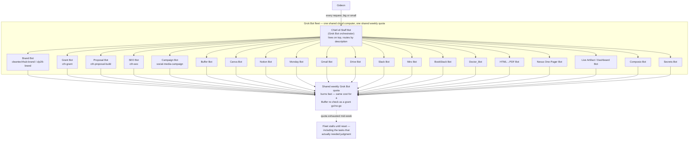
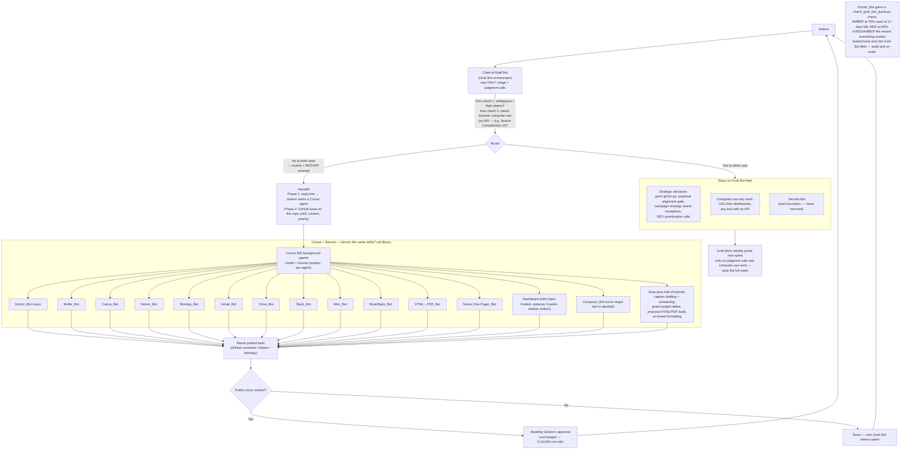

# Grok Bot ⇄ Cursor/Sonnet — wire diagrams

Both diagrams show the same 21-skill CTH bot roster. The only thing that
changes is **where each Bot's execution happens** and **which model pays
for it**. Nothing in the MCP config, the skill files, or the Approval Gate
changes.

## Before — everything runs inside the Grok Bot fleet

Every Bot, regardless of how mechanical its job is, lives on the same
shared cloud computer and draws from the same weekly Grok Bot token
allowance. There is no cheap tier inside the fleet itself, so trivial
daily chores and genuine strategic decisions cost the same thing.

**Problem in one sentence:** the fleet has one price tier, so the 90% of
tasks that are mechanical crowd out the 10% that actually need the Chief
of Staff's judgment.

## After — Grok Bot orchestrates, Cursor/Sonnet executes

The Chief-of-Staff Bot keeps doing exactly what it's good at: deciding
which lane a request belongs in. Everything that's routine **and**
already covered by an MCP connector or API this repo has wired up moves
to a Cursor background agent running Sonnet — a separate execution
surface with its own model choice, so it stops competing with strategic
work for the same tokens. Tasks that genuinely need Grok Bot's
browser/computer-use (no API exists) stay put. `secrets` never moves,
full stop.

## Per-skill scoring (both axes)

"MCP/API?" = Cursor already has a wired connector or API/CLI path for
this (see `.mcp.json` + BookStack's Docker/REST API + local Playwright for
HTML→PDF). "Judgment?" = does the core of the task require a real
decision, not just execution.

| Skill (CTH Bot) | MCP/API available? | Judgment-heavy? | Verdict |
|---|---|---|---|
| `doctor-bot` | Yes (MCP connector health + Shell/SSH for VPS) | No — read-only by design | **Full mirror → Cursor/Sonnet.** Best first candidate. |
| `buffer` | Yes (Buffer MCP) | No | **Full mirror → Cursor/Sonnet.** |
| `canva` | Yes (Canva MCP) | No | **Full mirror → Cursor/Sonnet.** |
| `notion` | Yes (Notion MCP) | No | **Full mirror → Cursor/Sonnet.** |
| `monday` | Yes (Monday MCP) | No | **Full mirror → Cursor/Sonnet.** |
| `google-drive` | Yes (Drive MCP) | No | **Full mirror → Cursor/Sonnet.** |
| `slack` | Yes (Slack MCP) | Mostly no (sensitive comms = escalate) | **Mirror, with an escalation rule for sensitive threads.** |
| `gmail` | Yes (Gmail MCP) | Mostly no (sensitive replies = escalate) | **Mirror, with an escalation rule for sensitive replies.** |
| `miro` | Yes (Miro MCP) | No | **Full mirror → Cursor/Sonnet.** |
| `bookstack` | Yes (Docker/REST API via Shell) | No | **Full mirror → Cursor/Sonnet.** |
| `html-to-pdf` | Yes (local Playwright, no external site) | No | **Full mirror → Cursor/Sonnet.** |
| `composio` | Yes (it's the gateway itself) | No, once target tool is picked | **Mirror once Grok Bot/user names the target integration.** |
| `live-artifact-build` | Partial — the "Cowork sidebar" mechanic is Claude-Cowork-specific | No | **Adapt, don't mirror 1:1** — Cursor produces a repo-hosted HTML/Markdown dashboard file instead. |
| `nexus-onepager` | Yes (static HTML, file-based deploy) | Only the content/brand call | **Hybrid** — content approved on Grok Bot, page build on Cursor/Sonnet. |
| `cleantechhub-brand` | Yes (formatting existing content) | Only co-branding edge cases | **Hybrid** — standard application on Cursor, exceptions escalate. |
| `clp26-brand` | Yes | Only edge cases | **Hybrid**, same pattern as above. |
| `social-media-campaign` | Yes (Buffer/Canva/Notion MCP) | Only the strategy-setup phase | **Hybrid** — strategy (brand/platforms/pillars/approval flow) stays on Grok Bot; captions, scheduling, monitoring, reporting → Cursor/Sonnet. |
| `cth-grant` | Partial (Drive/Gmail MCP for research/drafting) | Yes — go/no-go, budget/scope | **Hybrid** — decision stays on Grok Bot; drafting, budget tables, logframe assembly → Cursor/Sonnet. |
| `cth-proposal-build` | Yes (HTML build + local PDF export) | Yes — alignment gate | **Hybrid** — alignment gate stays on Grok Bot; HTML build/PDF export/deploy → Cursor/Sonnet. |
| `cth-seo` | Partial — no MCP for Google Search Console/Ads listed in `.mcp.json` | Yes — prioritization, cannibalization calls | **Mostly stays on Grok Bot.** Strategy and any GSC/Ads-dashboard work needs Grok Bot's computer-use; only in-repo work (meta tags, schema markup, on-page content in code) moves to Cursor/Sonnet. |
| `secrets` | N/A | N/A | **Never mirrored.** Stays exclusively on Grok Bot / VPS. Hard rule, not a judgment call. |

## Reading the diagrams

- The **shape of the fleet doesn't change** — same 21 bots, same jobs.
  What moves is the *execution surface* for the bottom two-thirds of the
  table.
- The Chief-of-Staff Bot's job description on Grok Bot should be edited to
  say explicitly: *"For any task that is routine and covered by an
  existing Cursor MCP connector or API, hand off to Cursor via GitHub
  issue instead of executing it yourself."* That one line is the entire
  implementation of Phase 2.
- Doctor_Bot's new quota check is the feedback loop that catches drift —
  if routine work quietly creeps back onto the Grok Bot fleet, it shows up
  as an unexplained rise in weekly token burn before the quota actually
  runs out.
